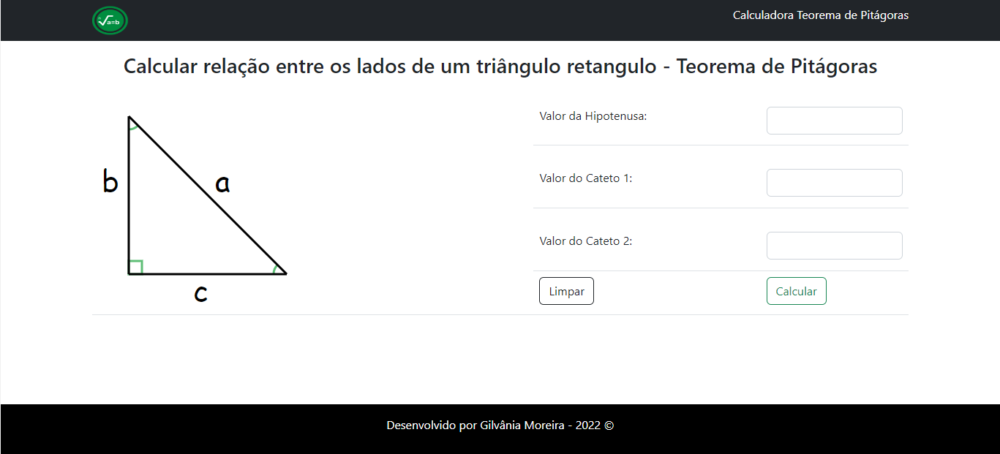

# Introdução
Este projeto foi desenvolvido para o desafio de calcular a relação dos lados de um triângulo retângulo (mais conhecido popularmente como teorema de pitágoras).

O desenvolvimento da interface da calculadora foi feito utilizando HTML5, CSS3, bootstrap e como linguagem de
programação foi utilizado JavaScript para as funcionalidades.

   

Foi desenvolvido também uma API em python utilizando flask para realizar os calculos no backend.

As chamadas à API são realizadas utilizando requisições Jquery.

## Demostração
Foi feito o deploy da aplicação no Heroku, para testar basta acessar o link a seguir:

https://pythagoras-calculator.herokuapp.com/

## Contatos
Gilvânia Moreira
e-mail: moreiragil84@gmail.com

