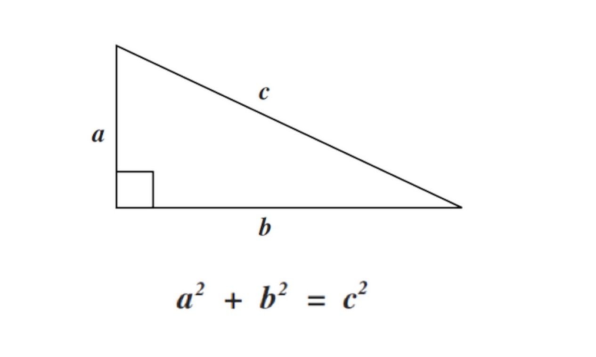

# Introdução
API REST para calcular a relação entre os lados de um triângulo retângulo pelo teorema de Pitágoras.


## Requisições

```http
POST /calcular
```

| Parâmetro | Tipo | Descrição |
| :--- | :--- | :--- |
| `a` | `float` | Lado a do triângulo |
| `b` | `float` | Lado b do triângulo |
| `c` | `float` | Lado c do triângulo |
| `precisao` | `int` | Número de casas decimais do resultado, padrão: 2 |

**Devem ser passados apenas 2 dos valores de a, b ou c. Por exemplo se desejo calcular o valor de c deve-se passar como parâmetro apenas a e b.**
*A precisão é opcional.*

## Resposta

A API irá retornar um JSON com os seguites campos: 

| Parâmetro | Tipo | Descrição |
| :--- | :--- | :--- |
| `a` | `float` | Resultado do calculo da hipotenusa |
| `b` | `float` | Resultado do calculo do 1º cateto |
| `c` | `float` | Resultado do calculo do 2º cateto |
| `error` | `string` | Descrição de um erro caso ocorra |

***Só será retornado um campo a cada requisição, correspondendo ao resultado desejado ou o error em caso de falha***
